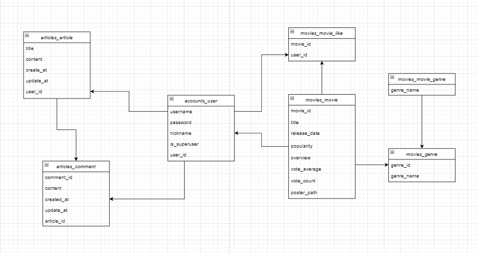
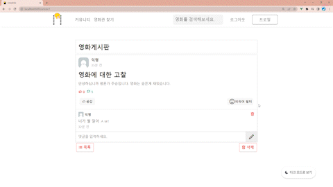

### 💻 필수 요구사항

| No. | 구분             | 기능                                                                                                                                                                     | 구현 정도(⭐⭐⭐⭐⭐) |
| --- | -------------- | ---------------------------------------------------------------------------------------------------------------------------------------------------------------------- | ------------ |
| 1   | 영화 데이터         | 최소 50개 이상 존재                                                                                                                                                       | ⭐⭐⭐⭐⭐        |
| 1   |                | 데이터는 fixtures를 사용하여 언제든 load 될 수 있도록 준비                                                                                                                                | ⭐⭐⭐⭐⭐        |
| 2   | 영화 추천 알고리즘 | - 박스오피스 순위 - 주간트렌드 순위 - 장르 추천                                                                                                                                  | ⭐⭐⭐⭐⭐        |
| 3   | API            | TMDB API를 이용                                                                                                                                                           | ⭐⭐⭐⭐⭐        |
| 4   | 커뮤니티           | 유저 간 소통 할 수 있는 커뮤니티 기능 구현                                                                                                                                              | ⭐⭐⭐⭐⭐        |
| 5   | README         | 1. 팀원 정보 및 업무 분담 내역 2. 목표 서비스 구현 및 실제 구현 정도 3. 데이터베이스 모델링 4. 영화 추천 알고리즘에 대한 기술적 설명 5. 서비스 대표 기능에 대한 설명 6. 배포 서버 URL(배포했을 경우) 7. 기타(느낀 점, 후기 등) | ⭐⭐⭐⭐⭐        |

### 🤝팀원 정보 및 업무 분담 내역

| 이름        | 담당 영역                                                                                             |
| --------- | ------------------------------------------------------------------------------------------------- |
| 전동인 팀장 | - 팀장 - 전체적인 프로젝트 진행 사항 점검 - 프론트엔드 주도 및 백엔드 서브 - DB에서 데이터를 받아와 프론트엔드 기능 구현 및 디버깅, 테스트  |
| 박주승       | - 프론트엔드  - 프론트엔드 기능 구현, 프론트엔드 디자인 정교화                                                          |
| 장준호       | - 백엔드 - DB 모델링, 백엔드 데이터 로직 작성 및 Movies, Articles, Accounts 구조화                                 |

### 🥇목표 서비스 구현 및 실제 구현 정도

### 🏗데이터 베이스 모델링(ERD)

### 📝영화 추천 알고리즘

- 박스오피스 순위
  
  - /movie/popular를 이용하여 가장 인기 있는 가장 인기 있는 영화로 구성
  
  - 당일 기준으로 하여 최신 개봉작을 내림차순하여 분류

- 주간트렌드 순위
  
  - /trending/movie/week, /trending/movie/top_rated를 이용하여 매주 최신화 되는 영화로 구성
  
  - 당일 기준으로 하여 최신 개봉작을 내림차순하여 분류

- 장르 추천
  
  - 모든 장르를 평점과 개봉일 순으로 내림차순하여 분류 후
  
  - 19개 장르 중 임의로 하나를 선택해 제시

### 🎨 서비스 대표 기능

* 영화에 대한 자유로운 대화를 위해 커뮤니티 기능에 중점을 두었습니다.
  
  * 자유로운 게시글 작성 가능
  
  * 댓글 작성시 익명으로 거침없는 자기 주장 피력!!
  
  * 건강한 커뮤니티 문화를 위한 최신 HOT 비속어 필터링!!
    
    

* 건조한 눈 때문에 영화 검색이 힘드시다구요!? Don't worry about that!!
  
  * 야간 사용시 여러분의 안구 건강을 위한 다크모드/라이트모드 전환 기능!!
  
  

### 🤔느낌점

* 전동인

* 박주승

* 장준호
  
  생애 첫 프로젝트를 해본 결과 나 혼자의 힘으로는 프로젝트를 구현하기 굉장히 어렵다는 것을 알았다. Django DB에 데이터를 쌓을때부터 어려움을 호소하여 Google과 동료들의 힘을 많이 빌렸다. Django DB에 데이터를 쌓기 위해 직적 .json 생성을 하고, 생성한 .json 파일에 우리 서비스에 필요한 것들을 담기위해 커스텀하는 과정들이 처음에는 신박하게 느껴졌다. 프로젝트를 진행하며 막히는 부분이 많아 어려움이 많았지만 충분히 고민하고 동료들과 소통한 결과 많은 어려움을 해결 할 수 있어 협업의 중요함을 많이 느낀 프로젝트 였습니다. 제 역량이 부족해 고생한 동료들에게 너무 미안함과 감사함을 전하고 싶습니다!
